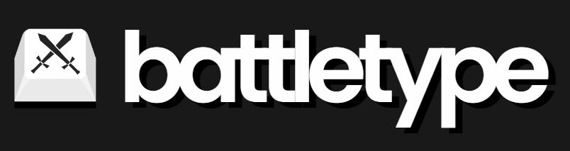

 
    

##  About
Battletype is an online multiplayer typing game. You can compete against your friends, or take a solo typing test!

[Insert Gif Here]

## 📝 Prerequisites and Instructions for Development
This project uses Node 20

1. Clone this repo
2. Install packages and dependencies with `npm install` in each `web` and `server` directories
3. To start local development
    * In `web` directory run `npm run dev`
    * In `server` directory run `npm run start`

## ⚙️ Config Variables
1. Create `.env` file in both root directories (`web` and `server`)
2. In the `web` add these config variables:
    * `NEXT_PUBLIC_GAME_SERVER_URL = "http://localhost:4000"`
3. In the `server` add these config variables:
    * `PORT = 4000`
    * `ORIGIN = "http://localhost:3000"`

## 📋 Tech Stack
* NodeJS 
* ReactJS 
* Typescript 
* Socket.io 
* Mantine 
* TailwindCSS

## ⭐️ Authors 
* [Ying Liang](https://github.com/YingLiang2)
* [Jonathan Placakta](https://github.com/jonathanplacatka)

## ❤️ Acknowledgements
Special thanks to [Alborz Khakbazan](https://github.com/alborzk) for providing images, and graphics for our design but also being a source of development inspiration and our design consultant.

